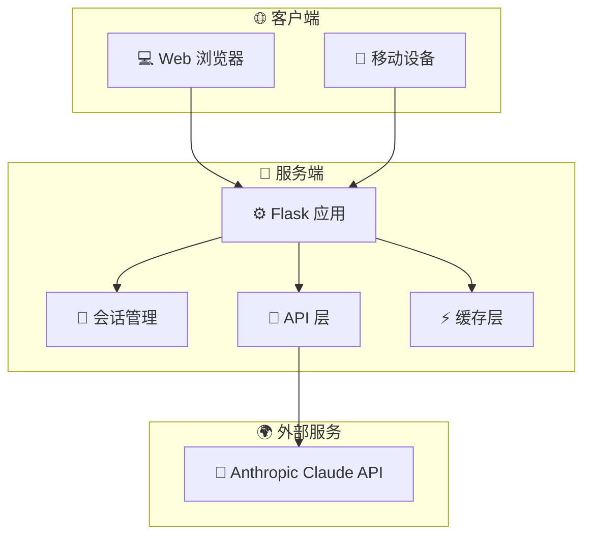

<!-- markdownlint-disable MD041 -->
<div align="center">

<picture>
  <source media="(prefers-color-scheme: dark)" srcset="https://img.shields.io/badge/OpenCode_Agent-FFFFFF?style=for-the-badge&logo=github&logoColor=white&color=6366f1">
  <source media="(prefers-color-scheme: light)" srcset="https://img.shields.io/badge/OpenCode_Agent-FFFFFF?style=for-the-badge&logo=github&logoColor=black&color=6366f1">
  
</picture>

# 🦞 OpenCode Agent - 您的个人 AI 助手

⚡ **多会话支持** · 🔄 **流式响应** · 📊 **会话管理** · 💬 **Markdown 渲染**

[](https://github.com/none-ai/opencode-agent/stargazers)
[
[
[
[
[

---

[📖 文档](#快速开始) ·
[🚀 功能](#功能) ·
[💬 讨论](https://github.com/none-ai/opencode-agent/discussions) ·
[🐛 问题反馈](https://github.com/none-ai/opencode-agent/issues)

</div>

---

## ✨ 简介

🦞 **您的个人 AI 助手** - 任何操作系统，任何平台，龙虾的方式。

OpenCode Agent 是一个强大的 AI 聊天应用，基于 Anthropic 的 Claude API 构建，提供智能对话、会话管理和流式响应功能。

## 🏗️ 系统架构



## ✨ 功能

| 功能 | 描述 |
|------|------|
| 💬 **多会话支持** | 创建和管理多个聊天会话 |
| 🤖 **Claude API 集成** | 基于 Anthropic Claude 的智能响应 |
| ⚡ **流式响应** | 实时流式输出 AI 响应 |
| 📂 **会话管理** | 查看、切换和删除聊天会话 |
| 📝 **Markdown 渲染** | 支持代码块和格式化响应 |
| ⚙️ **可配置设置** | 通过 config.yaml 轻松配置 |

## 🚀 快速开始

### 安装

```bash
# 克隆仓库
git clone https://github.com/none-ai/opencode-agent.git
cd opencode-agent

# 创建虚拟环境（推荐）
python -m venv venv
source venv/bin/activate  # Linux/Mac
# 或
venv\Scripts\activate     # Windows

# 安装依赖
pip install -r requirements.txt

# 运行应用
python app.py
```

访问 http://localhost:5000 体验您的 AI 助手！

### 配置

在项目根目录创建 `config.yaml` 文件：

```yaml
anthropic:
  api_key: your-api-key-here
  model: claude-3-5-sonnet-20241022
  max_tokens: 4096
  temperature: 1.0

app:
  host: 0.0.0.0
  port: 5000
  debug: true
```

或设置环境变量 `ANTHROPIC_API_KEY`。

## 📡 API 端点

| 路由 | 描述 |
|------|------|
| `/` | 主页 |
| `/chat` | 聊天界面 |
| `/api/chat` | 聊天 API 端点 |
| `/api/sessions` | 管理聊天会话（GET 列表，POST 创建） |
| `/api/sessions/<id>` | 获取或删除特定会话 |
| `/api/settings` | 获取和更新设置 |

## 🛠️ 开发

```bash
# 运行测试
pytest

# 使用 gunicorn 运行
gunicorn -w 4 -b 0.0.0.0:5000 app:app
```

## 📚 技术栈

- **后端**: Flask
- **AI**: Anthropic Claude API
- **前端**: HTML/CSS/JavaScript
- **配置**: PyYAML

## 🤝 贡献

欢迎贡献！请提交 Issue 或 Pull Request。

## 📄 许可证

MIT

---

**作者**: stlin256's openclaw
